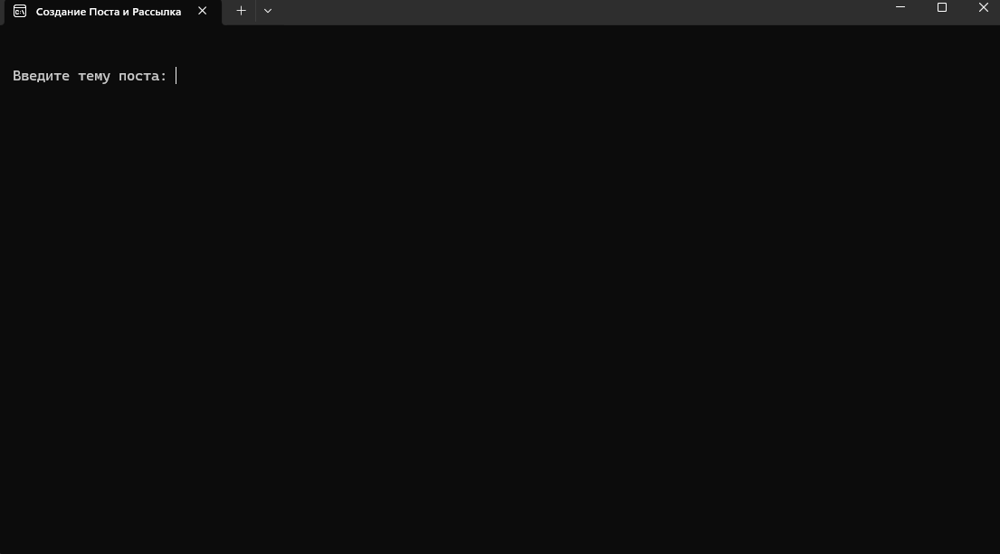

# telegram_mailing

## Описание проекта
Данный проект представляет собой программу для автоматизированного создания ярких 
и информативных постов на заданную пользователем тему с использованием возможностей 
GigaChat и поисковой системы Яндекс. Программа предназначена для владельцев телеграм-каналов,
которые хотят упростить и ускорить процесс создания качественного контента.
## Основные функции и шаги работы программы:
1) **Ввод темы статьи пользователем** <br/>
Пользователь задаёт тему, на которую будет создан пост.
2) **Поиск релевантной статьи через Яндекс** <br/>
Программа выполняет поиск подходящей статьи в поисковой системе Яндекс для обогащения контекста.
3) **Альтернативный источник — Википедия** <br/>
Если не удаётся получить релевантную статью через Яндекс, программа автоматически берёт информацию из Википедии.
4) **Генерация поста с помощью GigaChat API** <br/>
Используя найденный контекст, GigaChat создаёт качественный и стилистически выверенный пост, адаптированный под соцсети.
5) **Поиск и скачивание подходящей картинки** <br/>
Программа ищет и загружает релевантное изображение из интернета через поисковую систему Яндекс, соответствующее теме поста.
6) **Рассылка поста в Telegram-каналы** <br/>
Сгенерированный пост вместе с изображением автоматически отправляется во все каналы, указанные в переменной окружения ```CHANEL_NAMES```.
## Цель проекта
Автоматизировать процесс создания и публикации качественного
контента для владельцев телеграм-каналов, позволяя быстро получать 
информативные и визуально привлекательные посты без 
необходимости ручного поиска и подготовки материалов.
## Что необходимо для работы
Необходимо получить Ключ авторизации для обмена сообщениями с GigaChat API.
Ключ авторизации содержит информацию о версии API, к которой выполняются запросы. 
 [Все подробности.](https://developers.sber.ru/studio/login)<br/>
Так же необходимо создать телеграмм бота, которого сделать администратором
всех телеграмм каналов, куда планируется рассылка.


## Как запустить
Скачайте репозиторий
```commandline
git clone https://github.com/AlbertSabirzianov/telegram_mailing.git
```
Перейдите в каталог проекта
```commandline
cd telegram_mailing
```
Установите зависимости
```commandline
pip install -r src/requirements.txt
```


Создайте файл .env в папке src проекта со следующими переменными окружения
```
# Код от сбера giga chat
AUTHORIZATION_SB_CODE="example"
# Список каналов для рассылки
CHANEL_NAMES=["@example_1", "@example_2"]
# Токен бота (который является администратором всех каналов из CHANEL_NAMES)
BOT_TOKEN=1211212:Example
```
Можете запускать скрипт
```commandline
python main.py
```
## Как использовать
Сразу после запуска приложения вы увидите вот такое
окошко, где вам необходимо ввести выбранную вами тему поста
<br/>

```commandline
```
После того как вы введёте тему и нажмете Enter программа
создаст пост и разошлёт его во все указанные каналы.